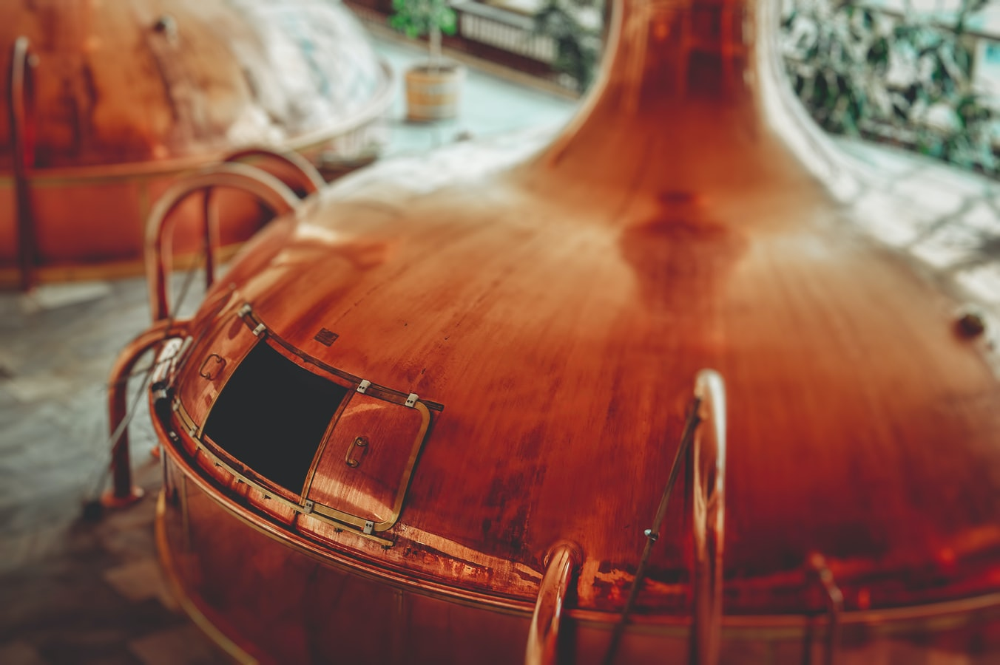

Hi, I am analysing tidytuesday, data can be found [here](https://github.com/rfordatascience/tidytuesday/tree/master/data/2020/2020-03-31).


Photo by <a href="https://unsplash.com/@martz90?utm_source=unsplash&utm_medium=referral&utm_content=creditCopyText">Martin Kníže</a> on <a href="https://unsplash.com/s/photos/beer-production?utm_source=unsplash&utm_medium=referral&utm_content=creditCopyText">Unsplash</a>
  

# Data exploration

```{r setup, include=FALSE}
knitr::opts_chunk$set(echo = FALSE, dpi = 96, message = FALSE, warning = FALSE)
```


```{r}
library(tidyverse)
library(lubridate)
theme_set(theme_light())
brewing_materials <- readr::read_csv('https://raw.githubusercontent.com/rfordatascience/tidytuesday/master/data/2020/2020-03-31/brewing_materials.csv') %>%
  mutate(date = ymd(paste(year, month, 1))) %>%
  filter(year < 2016)
beer_taxed <- readr::read_csv('https://raw.githubusercontent.com/rfordatascience/tidytuesday/master/data/2020/2020-03-31/beer_taxed.csv')
brewer_size <- readr::read_csv('https://raw.githubusercontent.com/rfordatascience/tidytuesday/master/data/2020/2020-03-31/brewer_size.csv')
beer_states <- readr::read_csv('https://raw.githubusercontent.com/rfordatascience/tidytuesday/master/data/2020/2020-03-31/beer_states.csv')

my_theme <- theme(strip.background = element_rect(fill = "#152238"),
        strip.text = element_text(colour = 'white', face = "bold"),
        axis.text.x = element_text(angle = 45, vjust = 1, hjust = 1))
```

## What ingredients are used in US beer production?

```{r}
brewing_materials %>%
  filter(date == max(date)) %>%
  filter(!str_detect(material_type, "Total")) %>%
  mutate(type = fct_reorder(type, month_current)) %>%
  ggplot(aes(month_current/1e6, type, fill = material_type)) +
  geom_col() +
  scale_x_continuous(labels = scales::number_format()) +
  ggsci::scale_fill_lancet() +
  labs(title = "Monthly ingredients used in 2008",
       x = "Number of barrels in million",
       y = "Ingredient",
       fill = "Type of material")

brewing_materials %>%
  filter(!str_detect(material_type, "Total")) %>%
  mutate(type = fct_reorder(type, month_current, sum)) %>%
  ggplot(aes(date, month_current, color = type)) +
  geom_line(size = 1.2) +
  facet_wrap(~type, scales = "free_y", ncol = 2) +
  scale_y_continuous(labels = scales::comma) +
  labs(x = "Time",
       y = "Pounds used in beer production",
       fill = "Material",
       title = "Monthly used ingredients over time") +
  theme(legend.position = "none") +
  my_theme
```

__Focus: Malt and Sugar & Syrups are besides hops the most used ingredients but they seem to be correlated.__


```{r}
brewing_materials %>%
  filter(str_detect(material_type, "Total.*products")) %>%
  mutate(type = fct_reorder(type, month_current, sum)) %>%
  ggplot(aes(date, month_current, fill = type)) +
  geom_line(size = 1.2) +
  facet_wrap(~type, ncol = 1, scales = "free_y") +
  scale_y_continuous(labels = scales::comma) +
  labs(x = "Time",
       y = "Pounds used in beer production",
       fill = "Material",
       title = "Monthly used types of ingedients over time") +
  my_theme
```

## Brewer size distribution

```{r}
brewer_size %>%
  filter(brewer_size != "Total", !is.na(total_barrels)) %>%
  mutate(brewer_size = fct_lump(brewer_size, 5, w = total_barrels),
         barrel_number = coalesce(parse_number(as.character(brewer_size)), 1),
         brewer_size = fct_reorder(brewer_size, barrel_number)) %>%
  filter(brewer_size != "Other") %>% 
  ggplot(aes(year, total_barrels, fill = brewer_size)) +
  geom_line(size = 1.2) +
  scale_y_continuous(labels = scales::comma) +
  scale_x_continuous(breaks = seq(2010, 2018, 2)) +
  facet_wrap(~brewer_size, ncol = 1, scales = "free_y") +
  labs(title = "Brewer size distribution over years",
       x = "",
       y = "Total barrels") +
  my_theme
```

```{r}
brewing_materials %>%
  filter(material_type == "Total Used") %>%
  ggplot(aes(month, month_current, color = factor(year))) +
  geom_line(size = 1.2, alpha = 0.8) +
  expand_limits(y = 0) +
  labs(title = "Total monthly used brewing materials over years",
       fill = "Year",
       x = "Month",
       y = "Current Monthly used") +
  ggsci::scale_color_lancet()
```

## Where is beer produced?


```{r}
library(maps)
library(sf)

state_percents_2019 <- beer_states %>%
  filter(year == max(year), state != "total") %>%
  group_by(state, year) %>%
  mutate(percent = barrels / sum(barrels)) %>%
  ungroup()

states <- st_as_sf(map("state", plot = FALSE, fill = TRUE))
states_joined <- state_percents_2019 %>%
  mutate(ID = str_to_lower(state.name[match(state, state.abb)])) %>%
  inner_join(states, by = "ID")

states_joined %>%
  filter(type == "On Premises") %>%
  ggplot(aes(geometry = geom, fill = percent)) +
  geom_sf() +
  scale_fill_viridis_c(
                       labels = scales::percent) +
  theme_void() +
  labs(title = "In which states is a lot of beer produced consumed on premises?",
       fill = "% consumed on prem.")

states_joined %>%
  ggplot(aes(geometry = geom, fill = percent)) +
  geom_sf() +
  facet_wrap(~ type, nrow = 2) +
  scale_fill_viridis_c(
                       labels = scales::percent) +
  theme_void() +
  theme(legend.position = "right") +
  labs(title = "How is beer consumed within each state?",
       fill = "% consumed") 
```


# Predicting relationship of Malt and Sugar & Syrup for capacity building

```{r}
library(tidymodels)

brewing_filtered <- brewing_materials %>%
  filter(
    type %in% c(
      "Malt and malt products",
      "Sugar and syrups",
      "Hops (dry)"
    ),
    year < 2016,
    !(month == 12 & year %in% 2014:2015)
  ) %>%
  mutate(
    date = paste0(year, "-", month, "-01"),
    date = lubridate::ymd(date)
  )

brewing_materials_wide <- brewing_filtered %>%
  select(date, type, month_current) %>%
  pivot_wider(
    names_from = type,
    values_from = month_current
  ) %>%
  janitor::clean_names()

g1 <- brewing_materials_wide %>%
  ggplot(aes(malt_and_malt_products, sugar_and_syrups)) +
  geom_smooth(method = "lm") +
  geom_point() +
  scale_x_continuous(labels = scales::comma) +
  scale_y_continuous(labels = scales::comma) +
  labs(title = "Predicting relation of sugar and malt usage",
       subtitle = "Model: linear regression",
       x = "Malt products",
       y = "Sugar products")

beer_fit <- lm(sugar_and_syrups ~ 0 + malt_and_malt_products,
  data = brewing_materials_wide
)

g2 <- tidy(beer_fit, conf.int = TRUE) %>% 
  mutate(label = c("Malt products")) %>% 
  ggplot(aes(estimate, label, xmin = conf.low, xmax = conf.high)) +
  geom_point() +
  geom_errorbarh(height = 0.2) +
  geom_vline(xintercept = 0, linetype = "dashed") +
  labs(title = "Beer use more sugar when they use more malt!",
       subtitle = "Explicity 0.21 more sugar barrels peer beer barrel.",
       y = "")

library(patchwork)
g1 / g2
```


## Resampling and Model evaluation

```{r}
# 1000 resamples with bootstrapping
set.seed(2021)
beer_boot <- bootstraps(brewing_materials_wide, times = 1e3, apparent = TRUE)

if(!file.exists("models.RData")) {
  beer_models <- beer_boot %>%
  mutate(
    model = map(splits, ~lm(sugar_and_syrups ~ 0 + malt_and_malt_products, data = .)),
    coef_info = map(model, tidy)
  )
  save(beer_models, file = "models.RData")
} else {
  load("models.RData")
}

beer_coefs <- beer_models %>%
  unnest(coef_info)

beer_coefs %>%
  mutate(ind = 1) %>% 
  ggplot(aes(estimate, fill = ind)) +
  geom_histogram() +
  theme(legend.position = "none") 

if(!file.exists("model_aug.RData")) {
  beer_aug <- beer_models %>%
    sample_n(200) %>%
    mutate(augmented = map(model, augment)) %>%
    unnest(augmented)
  save(beer_aug, file = "model_aug.RData")
} else {
  load("model_aug.RData")
}

beer_aug %>% 
  mutate(ind = 1) %>% 
  ggplot(aes(malt_and_malt_products, sugar_and_syrups, color = ind)) +
  geom_line(aes(y = .fitted, group = id), alpha = .1) +
  geom_point() +
  labs(title = "1000 predictions of the relation for sugar and malt usage",
       subtitle = "Model: linear regression with resampling",
       x = "Malt products",
       y = "Sugar products") +
  theme(legend.position = "none") +
  scale_x_continuous(labels = scales::comma) +
  scale_y_continuous(labels = scales::comma)

```

With this model the capacity of used sugar for the usage of malt can be predicted.
