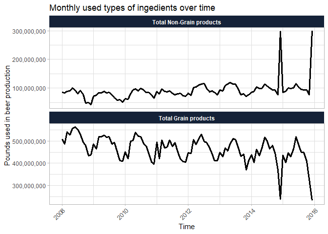
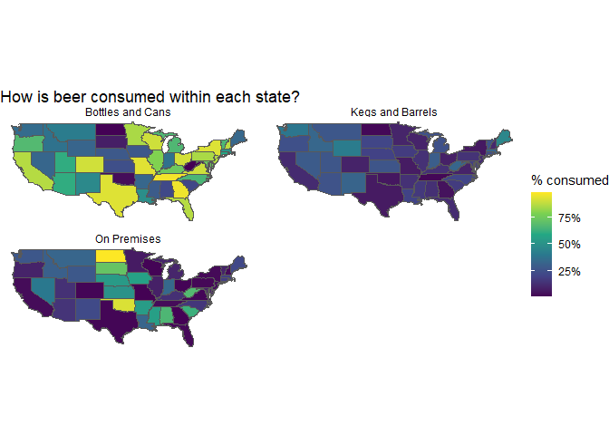

TBB Beer Production
================
Stephan
Jul 12, 2021

Hi, I am analysing tidytuesday, data can be found
[here](https://github.com/rfordatascience/tidytuesday/tree/master/data/2020/2020-03-31).

 Photo by
<a href="https://unsplash.com/@martz90?utm_source=unsplash&utm_medium=referral&utm_content=creditCopyText">Martin
Kníže</a> on
<a href="https://unsplash.com/s/photos/beer-production?utm_source=unsplash&utm_medium=referral&utm_content=creditCopyText">Unsplash</a>

What ingredients are used in US beer production?

<!-- --><!-- --><!-- -->

### Brewer size distribution

<!-- -->

<!-- -->

### Where is beer produced?

<!-- --><!-- -->
