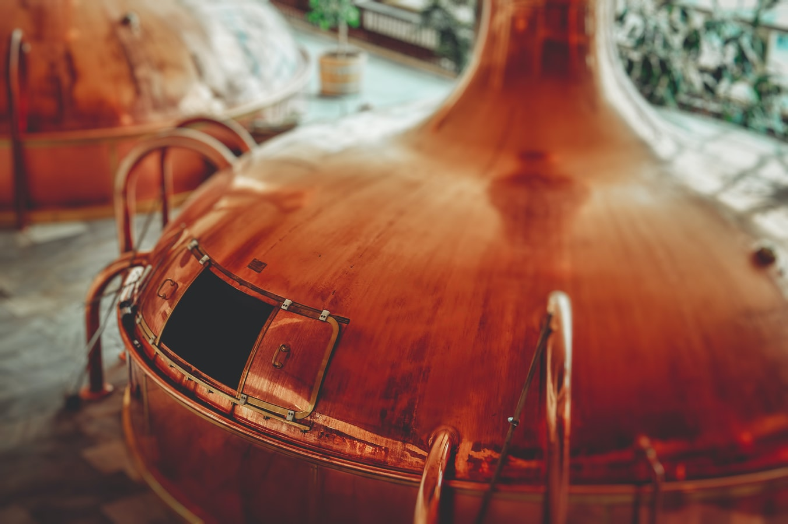
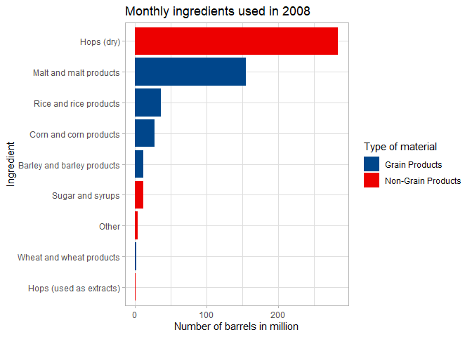
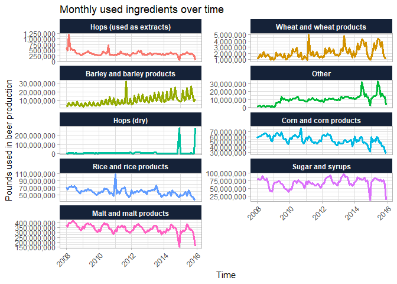
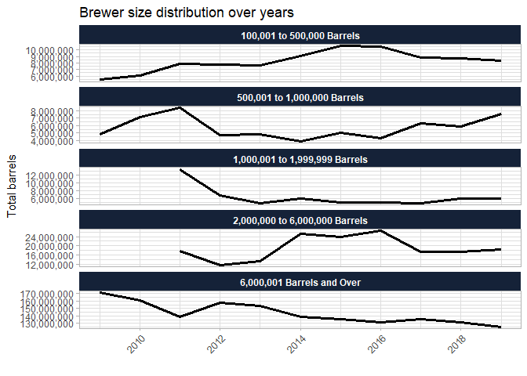
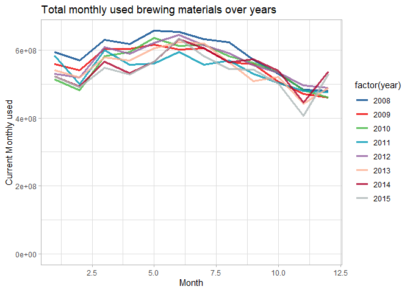
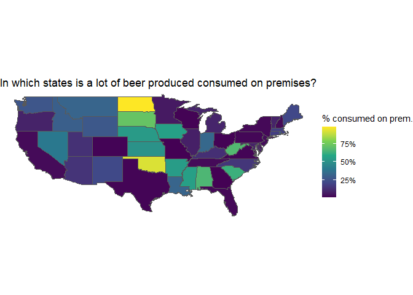
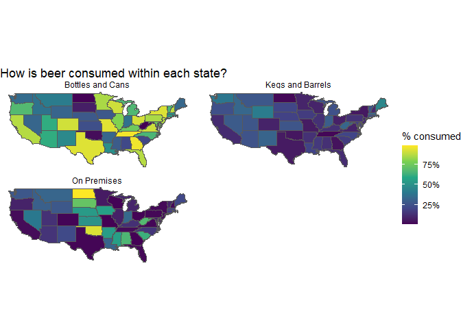
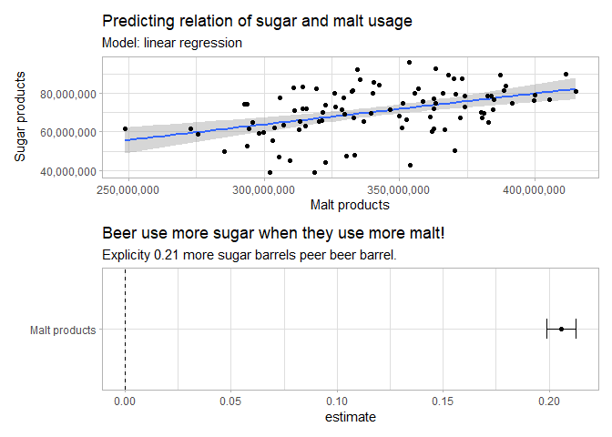
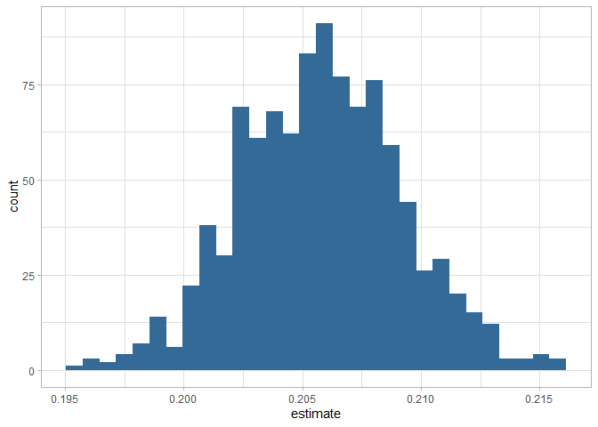
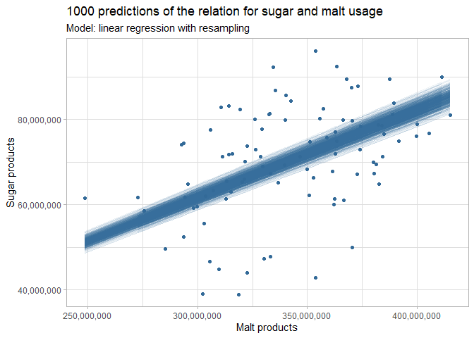

TBB Beer Production
================
Stephan
Jul 13, 2021

-   [1 Data exploration](#data-exploration)
    -   [1.1 What ingredients are used in US beer
        production?](#what-ingredients-are-used-in-us-beer-production)
    -   [1.2 Brewer size distribution](#brewer-size-distribution)
    -   [1.3 Where is beer produced?](#where-is-beer-produced)
-   [2 Predicting relationship of Malt and Sugar & Syrup for capacity
    building](#predicting-relationship-of-malt-and-sugar--syrup-for-capacity-building)
    -   [2.1 Resampling and Model
        evaluation](#resampling-and-model-evaluation)

Hi, I am analysing tidytuesday, data can be found
[here](https://github.com/rfordatascience/tidytuesday/tree/master/data/2020/2020-03-31).

 Photo by
<a href="https://unsplash.com/@martz90?utm_source=unsplash&utm_medium=referral&utm_content=creditCopyText">Martin
Kníže</a> on
<a href="https://unsplash.com/s/photos/beer-production?utm_source=unsplash&utm_medium=referral&utm_content=creditCopyText">Unsplash</a>

# 1 Data exploration

## 1.1 What ingredients are used in US beer production?

<!-- --><!-- -->

**Focus: Malt and Sugar & Syrups are besides hops the most used
ingredients but they seem to be correlated.**

<!-- -->

## 1.2 Brewer size distribution

<!-- -->

<!-- -->

## 1.3 Where is beer produced?

<!-- --><!-- -->

# 2 Predicting relationship of Malt and Sugar & Syrup for capacity building

<!-- -->

## 2.1 Resampling and Model evaluation

<!-- --><!-- -->

With this model the capacity of used sugar for the usage of malt can be
predicted.
